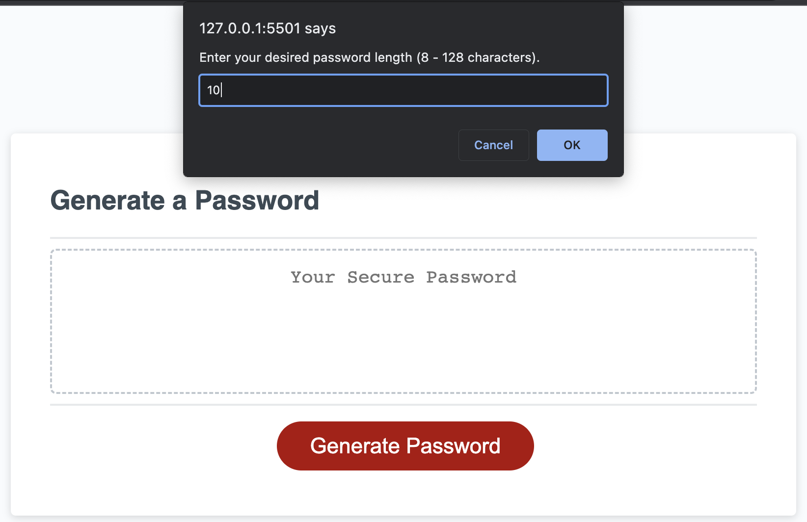
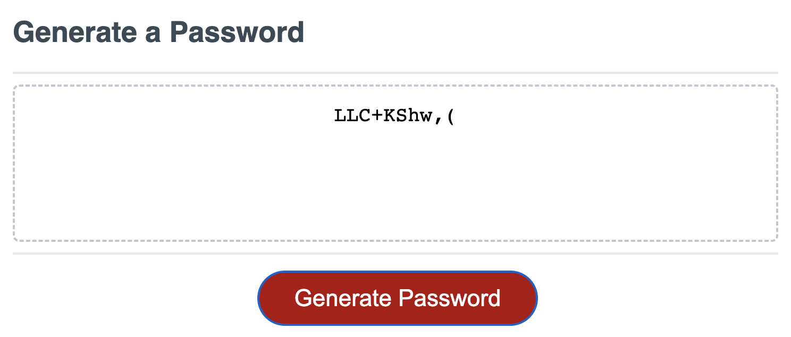

# Randomized Password Generator

## Link to deployed application

## Visual Representation:

## Overview 
The purpose of this project was to create a randomized password generator using Javascript. This is so the user can create a password meeting certain criteria to increase security of the user's information.

